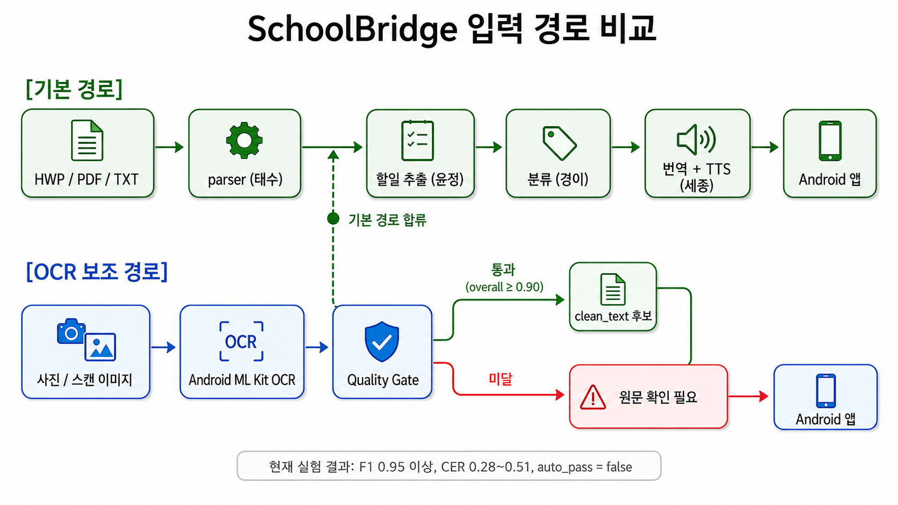

# SchoolBridge OCR Lab

> 학교 안내문 사진 입력의 가능성을 수치로 검증한 독립 실험실



---

## 왜 이게 필요했나

SchoolBridge는 단순 번역기가 아닙니다.

**학교 안내문을 읽기 어려운 사람이 핵심 정보를 이해하고 행동할 수 있게 돕는 서비스**입니다.

그런데 모든 사용자가 파일을 준비할 수 있는 건 아닙니다.

```
파일이 없는 사용자
→ 종이 안내문만 있는 다문화 학부모
→ 카카오톡으로 받은 이미지 스크린샷
→ 학교 앞 게시판 사진
```

이런 사용자에게 "PDF로 올려주세요"라고 하면 서비스가 끊깁니다.

그래서 **사진으로도 입력받을 수 있는지** 수치로 검증했습니다.

---

## 팀 파이프라인에서의 위치

```
[기본 경로 — 변경 없음]

HWP / PDF / TXT
  → 태수님 parser  →  clean_text
  → 윤정님 할일 추출  →  경이님 분류
  → 세종 NLLB 번역 / TTS
```

```
[OCR Lab이 검증한 보조 경로]

사진 / 스캔 이미지
  → Android ML Kit OCR  or  Tesseract OCR
  → Quality Gate  ←── 이게 핵심
       ├─ 통과 (overall ≥ 0.90)  →  clean_text 후보  →  기본 경로 연결 가능
       └─ 미달                   →  "원문 확인 필요" 안내
```

OCR Lab은 **기본 경로를 대체하지 않습니다.**
태수님 파트를 건드리지 않았고, 팀 메인 레포에도 코드를 넣지 않았습니다.
별도 실험실에서 가능성과 한계를 수치로 확인했습니다.

---

## 실험 결과 요약

### Android ML Kit OCR

| 지표 | 결과 | 목표 | 판정 |
|---|---|---|---|
| overall_score | 0.81 ~ 0.82 | ≥ 0.90 | 미달 |
| F1 | 0.947 ~ 0.965 | ≥ 0.90 | **통과** |
| CER | 0.28 ~ 0.51 | ≤ 0.10 | 미달 |
| 자동 통과 (auto_pass) | false | true | 미달 |

**Tesseract보다 결과가 좋았습니다.** 하지만 둘 다 자동 확정 기준에는 미달입니다.

### 해석

```
F1 0.95 이상  →  "어떤 단어가 있는지"는 꽤 잘 잡는다
CER 0.28~0.51  →  "글자 순서, 줄 순서"까지 정확하게는 어렵다
```

즉, **핵심 단어가 있는지 확인**하는 용도로는 가능성이 있지만,
**글자 단위로 자동 확정**하기에는 아직 부족합니다.

### 발표할 때 이렇게 말하면 됩니다

> "Android ML Kit OCR은 F1 0.95 이상으로 핵심 단어 탐지는 가능했지만,
> CER과 줄 순서 정확도 한계로 인해 사용자 확인 없는 자동 처리는 어렵다고 판단했습니다.
> 따라서 MVP에서는 HWP/PDF/text 기반 clean_text를 기본 경로로 두고,
> 사진 OCR은 review_required가 필요한 보조 입력 경로로 분리했습니다."

---

## 이게 실패가 아닌 이유

처음 강사님이 OCR을 말린 이유는 아마 이것 때문이었을 겁니다.

> OCR을 MVP 핵심 기능으로 넣다가 프로젝트 전체를 망치지 말라

이번에 한 작업은 다릅니다.

- 팀 메인 레포를 건드리지 않았습니다
- 독립 실험실에서만 진행했습니다
- 실패/한계까지 수치로 남겼습니다
- Quality Gate로 안전장치를 만들었습니다

**무리한 확장이 아니라, 리스크를 분리한 검증 작업입니다.**

---

## 구현된 것들

### 1. Tesseract OCR Lab

로컬에서 돌아가는 OCR 파이프라인입니다.

```
사진 입력
  → 자동 회전 보정 (0 / 90 / 180 / 270도 후보 평가)
  → 전처리 6종 variant (grayscale / threshold / warped 등)
  → 표/박스 영역 crop + 2배 / 3배 확대 OCR
  → 셀 단위 구조 복원 (행/열 분리, 패턴 추출)
  → result.json 저장
```

샘플 실행 결과:
- 가정통신문: URL 복원 성공 (`www.sarlang.com`), 날짜 패턴 추출, CER 0.57
- 급식표 3종: 자동 회전 보정 성공, 표 셀 구조 복원 성공 (line_split 방식)

### 2. Quality Gate

OCR 결과의 신뢰도를 자동으로 평가합니다.

```python
# 4개 점수를 합산해 overall_score 계산
text_quality  # 쓰레기 문자 비율, 의미 있는 단어 밀도
pattern       # URL / 전화번호 / 날짜 / 시간 / 금액 탐지 여부
table         # 표 후보 탐지, 셀 OCR 성공률
coherence     # 문장 구조, 줄 수, 문서 길이
```

결과 분기:
```
overall ≥ 0.90  →  verified_text.txt  (자동 통과 후보)
overall < 0.90  →  review_text.txt    (원문 확인 필요)
```

현재 실험 결과에서는 모든 샘플이 `auto_pass=false`입니다.

### 3. Model Input Builder

OCR 결과나 PDF 변환 텍스트를 후속 모델 입력 전 정제하는 도구입니다.

```powershell
# PDF 텍스트 정제
python tools\build_model_input.py --text "OCR\meal_notice.txt" --output outputs\model_input

# OCR result.json 정제
python tools\build_model_input.py --result-json outputs\ocr_experiment\sample01\result.json --output outputs\sample01\model_input
```

---

## 다음 단계

| 우선순위 | 작업 | 예상 효과 |
|---|---|---|
| 1 | 날짜 regex 강화 (M≤12, D≤31 검증) | 영양성분 소수점 오탐 제거 |
| 2 | `_MAX_CELLS` 조건부 확대 | 5주 급식 캘린더 전체 복원 |
| 3 | PDF 경로 실험 (pdf2image + poppler) | CER ≤ 0.15 기대 |
| 4 | 팀 레포 parser.py에 TODO만 남기기 | 사진 입력 자리 예약 |

```python
# 팀 레포에 남길 TODO
# TODO(sejong): image/photo input via Android ML Kit OCR + Quality Gate
# Current conclusion: image OCR requires review_required by default.
```

---

## 빠른 실행

```powershell
python -m venv .venv
.\.venv\Scripts\Activate.ps1
pip install -r requirements-ocr.txt
Copy-Item .env.example .env
notepad .env   # Tesseract 경로 지정
python run_ocr_experiment.py --input data\samples\sample01.jpg
```

샘플 이미지는 저장소에 포함하지 않습니다. `data/samples/`에 직접 준비하세요.

---

## 세부 문서

| 문서 | 내용 |
|---|---|
| [docs/experiment_log.md](docs/experiment_log.md) | 가정통신문 / 급식표 샘플별 실험 결과 수치 |
| [docs/score_history.md](docs/score_history.md) | Android ML Kit OCR 라운드별 점수 기록 |
| [docs/pdf_vs_photo_ocr_comparison.md](docs/pdf_vs_photo_ocr_comparison.md) | PDF vs 사진 OCR 비교 분석 |

---

## 이 저장소에서 하지 않는 것

- FastAPI / Android / NLLB / TTS 연결
- 팀 메인 레포 코드 통합
- OCR 결과를 학습 데이터로 저장
- OCR 결과를 사람 검수 없이 번역 입력으로 바로 사용

---

## 한 줄 결론

> OCR은 완전 자동 입력으로 쓰기엔 아직 부족하지만,
> Quality Gate와 review_required UX를 붙이면
> **사진 입력 보조 경로**로 가능성이 있다.
> 이걸 수치로 확인한 것이 이 실험실의 역할입니다.
